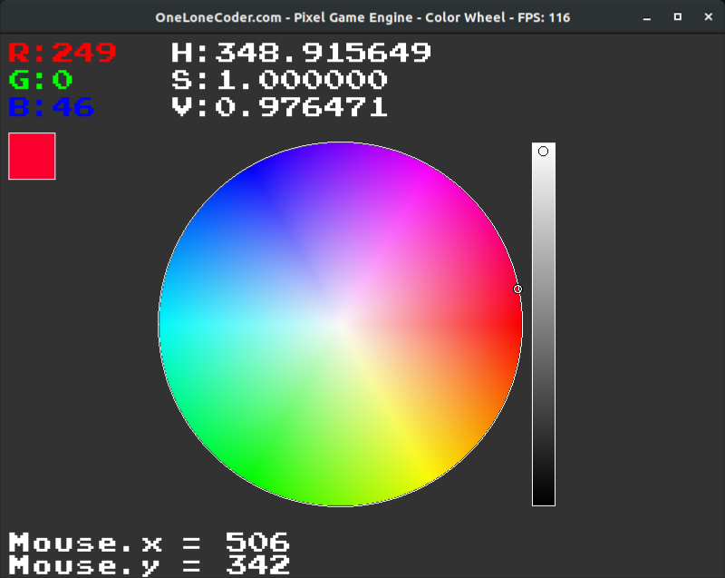

# Color Wheel Widget

A color wheel widget chart for color selection. The colors are selected in a HSV 
(Hue, Saturation, Value/Brightness) scale and converted to RGB.

The purpose of the code is to provide a raw implementation of both the 
construction of the wheel and the mouse handle commands for selection, 
as a simple tool to learn both C++ and color mapping. The algorithm can 
be easily ported to other graphics engines like SDL or SFML.

## Install
The makefile attached provides all flags for compilation, considering Linux OS, 
requiring only a `make` command. Although olcPGE is multiplatform, this code is 
primarily made for Linux OS, without any testing in Windows, however, it shall be 
trivially portable. 

In order to run on Linux, the application must be executed with `vblank_mode=0 ./application`, 
avoiding FPS locking. The olcPGE compilation requires basic obtainable libraries, which 
can be retrieved in Ubuntu with:

`sudo apt install build-essential libglu1-mesa-dev libpng-dev`

More information for other distros can be found at:
https://github.com/OneLoneCoder/olcPixelGameEngine/wiki/Compiling-on-Linux

# Credits
The graphic interface is based on the well made educational engine 
tool olcPixelGameEngine, which is credited to Javidx9 for releasing 
it for free. His YouTube channel is a valuable source of information and 
brilliant tutorials in C++ programming, along with vast information on the 
engine he developed:

https://www.youtube.com/channel/UC-yuWVUplUJZvieEligKBkA

and of course, the olcPGE git source:

https://github.com/OneLoneCoder/olcPixelGameEngine

A little bit of color mapping theory, particularly HSV/HSL system and RGB 
can be found in https://en.wikipedia.org/wiki/HSL_and_HSV; which includes 
the conversion formulas used in this application.

This kind of color wheel is commonly found in graphic softwares, particularly 
in Blender and MacOS applications and I hope it becomes useful in case one 
wish to implemented it by hand in a program and to provide the same amount of 
fun as I had studying it.

Corrections, suggestions or tips are heavily welcomed.
Feel free to enjoy, hack and copy it as your will command.

Implemented by M. Lazarotto (07/12/2020)
